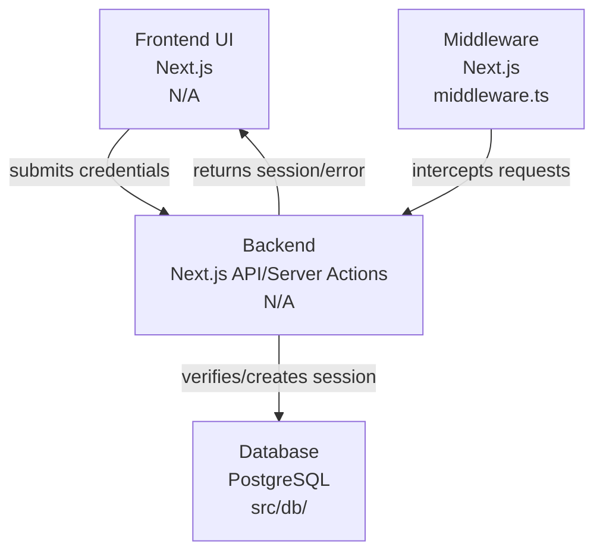
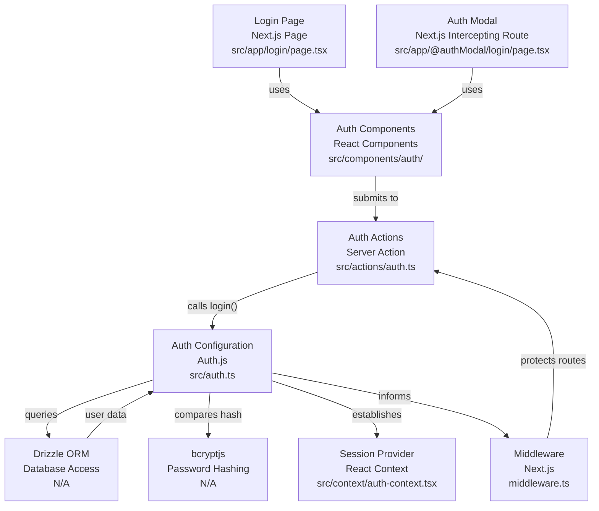
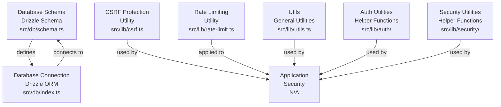

# Codebase Research Report

## Query
show me auth work flow.

## Answer
# Authentication Workflow Report

This report outlines the authentication workflow within the DocFlow application, detailing the key components, their responsibilities, and their interactions.

## High-Level Architecture

The authentication system is primarily handled by the **Next.js backend** for credential verification and session management, with **Next.js frontend components** providing the user interface for login. Middleware intercepts requests to enforce authentication, and a database stores user and session information.

*   **Frontend (UI)**: Handles user input for login and displays authentication-related modals.
*   **Backend (Next.js API Routes/Server Actions)**: Processes login requests, verifies credentials, creates sessions, and manages user roles.
*   **Middleware**: Protects routes by checking authentication status before allowing access.
*   **Database**: Stores user credentials (hashed), roles, and session information.

## Mid-Level Workflow: User Login

The user login process involves the following steps and components:

### 1. User Interface and Input

The primary entry point for user authentication is the login page or an authentication modal.

*   **Login Page**: [src/app/login/page.tsx](src/app/login/page.tsx)
    *   Provides the form for users to enter their credentials.
*   **Authentication Modal**: [src/app/@authModal/login/page.tsx](src/app/@authModal/login/page.tsx)
    *   An intercepting route that displays the login form as a modal over the current page.
*   **Auth Components**: [src/components/auth/](src/components/auth/)
    *   Contains reusable UI components related to authentication, such as forms and buttons.

### 2. Credential Submission and Server Actions

When a user submits their credentials, a **Server Action** is invoked to handle the authentication logic on the server.

*   **Auth Actions**: [src/actions/auth.ts](src/actions/auth.ts)
    *   Contains the `login` function responsible for processing the submitted credentials.
    *   This function interacts with the authentication library to verify the user.

### 3. Authentication Core Logic

The core authentication logic, including credential verification and session management, is encapsulated within the **Auth.js (NextAuth.js)** configuration.

*   **Auth Configuration**: [src/auth.ts](src/auth.ts)
    *   Defines the authentication providers (e.g., Credentials provider).
    *   Configures callbacks for session management (`jwt`, `session`).
    *   The `authorize` function within the Credentials provider is crucial for validating user input against the database.
    *   It uses the **Drizzle ORM** to query the database for user information.
    *   It handles password hashing and comparison using `bcryptjs`.

### 4. Session Management

Upon successful authentication, a session is established, and user information is stored.

*   **Session Provider**: [src/context/auth-context.tsx](src/context/auth-context.tsx)
    *   Provides the authentication context to client components, allowing them to access session data.
*   **Session Handling in Auth.js**: [src/auth.ts](src/auth.ts)
    *   The `jwt` callback in [src/auth.ts](src/auth.ts) is responsible for persisting user information (like ID, email, roles) into the JWT token.
    *   The `session` callback then exposes this information to the client-side session object.

### 5. Route Protection with Middleware

The **Next.js Middleware** is used to protect routes, ensuring that only authenticated users can access certain parts of the application.

*   **Middleware**: [middleware.ts](middleware.ts)
    *   Intercepts incoming requests.
    *   Checks the authentication status of the request using the configured Auth.js instance.
    *   Redirects unauthenticated users to the login page or an unauthorized page.
    *   It also handles authorization based on roles and permissions.

## Low-Level Implementation Details

### Database Interaction

*   **Database Schema**: [src/db/schema.ts](src/db/schema.ts)
    *   Defines the `users` and `sessions` tables, including fields for `email`, `passwordHash`, `role`, etc.
*   **Database Connection**: [src/db/index.ts](src/db/index.ts) and [src/db/server.ts](src/db/server.ts)
    *   Establishes the connection to the PostgreSQL database using Drizzle ORM.

### Security Measures

*   **CSRF Protection**: [src/lib/csrf.ts](src/lib/csrf.ts)
    *   Provides utilities for Cross-Site Request Forgery protection, although its direct integration with Auth.js might be implicit or handled by Next.js's built-in protections for Server Actions.
*   **Rate Limiting**: [src/lib/rate-limit.ts](src/lib/rate-limit.ts)
    *   Implements rate limiting to prevent brute-force attacks on authentication endpoints. This is typically applied at the API route or middleware level.

### Utility Functions

*   **Utils**: [src/lib/utils.ts](src/lib/utils.ts)
    *   May contain general utility functions used across the application, potentially including helpers for authentication-related tasks like hashing or token manipulation.
*   **Auth Utilities**: [src/lib/auth/](src/lib/auth/)
    *   This directory would contain any specific helper functions or types related to authentication that are not part of the main Auth.js configuration.
*   **Security Utilities**: [src/lib/security/](src/lib/security/)
    *   Contains functions related to general security practices, which might be leveraged by the authentication system.

---
*Generated by [CodeViz.ai](https://codeviz.ai) on 8/13/2025, 10:45:58 AM*
