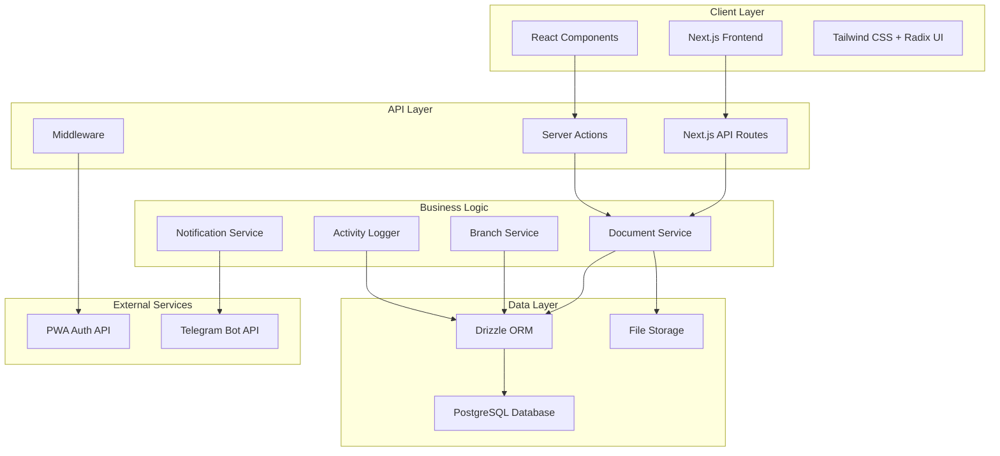

# Design Document

## Overview

The Docflow app is a document management system that extends the existing PWA authentication infrastructure to handle branch-based document workflows. The system leverages the current Next.js 15 architecture with PostgreSQL/Drizzle ORM, implementing role-based access control for document processing between districts and 22 branches in region R6. The design focuses on seamless integration with existing components while adding new document management capabilities, PDF handling, Telegram notifications, and comprehensive audit trails.

## Architecture

### System Architecture

The Docflow app follows the existing Next.js full-stack architecture pattern:



### Integration Points

1. **PWA Authentication**: Extends existing auth.ts with new roles and permissions
2. **Database Schema**: Adds new tables to existing schema.ts structure
3. **UI Components**: Reuses existing Radix UI components and patterns
4. **API Structure**: Follows existing server actions and API routes pattern

## Components and Interfaces

### Core Data Models

#### Branch Model
```typescript
interface Branch {
  id: number;
  baCode: number;           // 1060-1245 (22 branches)
  branchCode: number;       // 5521011-5521032
  name: string;            // "กปภ.สาขาขอนแก่น(ชั้นพิเศษ)"
  regionId: number;        // 6 (R6)
  regionCode: string;      // "R6"
  isActive: boolean;
  createdAt: Date;
  updatedAt: Date;
}
```

#### Document Model
```typescript
interface Document {
  id: number;
  filePath: string;
  originalFilename: string;
  fileSize: number;
  branchBaCode: number;    // References branches.baCode
  uploadDate: Date;
  mtNumber: string;        // เลขที่ มท
  mtDate: Date;           // วันที่ลงเลขที่ มท
  subject: string;        // เรื่องเบิกจ่าย
  monthYear: string;      // "มกราคม 2568"
  status: DocumentStatus;
  uploaderId: number;     // References users.id
  createdAt: Date;
  updatedAt: Date;
}

enum DocumentStatus {
  DRAFT = "draft",
  SENT_TO_BRANCH = "sent_to_branch",
  ACKNOWLEDGED = "acknowledged",
  SENT_BACK_TO_DISTRICT = "sent_back_to_district"
}
```

#### Comment Model
```typescript
interface Comment {
  id: number;
  documentId: number;
  userId: number;
  content: string;
  createdAt: Date;
}
```

### Service Layer Architecture

#### Document Service
```typescript
class DocumentService {
  // File operations
  async uploadFile(file: File, metadata: DocumentMetadata): Promise<Document>
  async validateFile(file: File): Promise<ValidationResult>
  async deleteFile(documentId: number): Promise<void>
  
  // Document CRUD
  async createDocument(data: CreateDocumentData): Promise<Document>
  async getDocument(id: number, userId: number): Promise<Document | null>
  async getDocumentsByBranch(branchBaCode: number, filters: DocumentFilters): Promise<Document[]>
  async updateDocumentStatus(id: number, status: DocumentStatus, userId: number): Promise<void>
  
  // Access control
  async canUserAccessDocument(userId: number, documentId: number): Promise<boolean>
  async getUserAccessibleBranches(userId: number): Promise<Branch[]>
}
```

#### Branch Service
```typescript
class BranchService {
  async getAllBranches(): Promise<Branch[]>
  async getBranchByBaCode(baCode: number): Promise<Branch | null>
  async getUserBranch(user: PWAUserData): Promise<Branch | null>
  async getBranchDocumentCounts(branchBaCode: number): Promise<DocumentCounts>
  async initializeBranchesFromCSV(): Promise<void>
}
```

#### Notification Service
```typescript
class NotificationService {
  async sendTelegramNotification(document: Document, branch: Branch): Promise<void>
  async formatDocumentNotification(document: Document, branch: Branch): Promise<string>
  async logNotificationSent(documentId: number, userId: number): Promise<void>
}
```

### User Interface Components

#### Document Upload Component
```typescript
interface DocumentUploadProps {
  onUploadComplete: (document: Document) => void;
  onError: (error: string) => void;
}

const DocumentUpload: React.FC<DocumentUploadProps> = ({
  onUploadComplete,
  onError
}) => {
  // File drag & drop
  // Form validation
  // Progress indication
  // Error handling
}
```

#### Document List Component
```typescript
interface DocumentListProps {
  branchBaCode?: number;
  status?: DocumentStatus;
  pagination: PaginationConfig;
  onDocumentClick: (document: Document) => void;
}

const DocumentList: React.FC<DocumentListProps> = ({
  branchBaCode,
  status,
  pagination,
  onDocumentClick
}) => {
  // Document filtering
  // Status badges
  // Pagination
  // Loading states
}
```

#### PDF Viewer Component
```typescript
interface PDFViewerProps {
  documentId: number;
  filePath: string;
  onError: (error: string) => void;
}

const PDFViewer: React.FC<PDFViewerProps> = ({
  documentId,
  filePath,
  onError
}) => {
  // PDF rendering
  // Zoom controls
  // Page navigation
  // Download functionality
}
```

### API Endpoints Design

#### Document Management APIs
```typescript
// Upload document
POST /api/documents
Content-Type: multipart/form-data
Body: {
  file: File,
  branchBaCode: number,
  mtNumber: string,
  mtDate: string,
  subject: string,
  monthYear: string
}
Response: { document: Document, success: boolean }

// Get documents by branch
GET /api/documents/branch/[branchBaCode]
Query: ?page=1&limit=10&status=all&search=""
Response: { documents: Document[], total: number, page: number }

// Get document detail
GET /api/documents/[id]
Response: { document: Document, comments: Comment[], canEdit: boolean }

// Update document status
PATCH /api/documents/[id]/status
Body: { status: DocumentStatus, comment?: string }
Response: { success: boolean, document: Document }

// Add comment
POST /api/documents/[id]/comments
Body: { content: string }
Response: { comment: Comment, success: boolean }
```

#### Dashboard APIs
```typescript
// Get dashboard metrics
GET /api/dashboard/metrics
Response: {
  totalDocuments: number,
  documentsByStatus: Record<DocumentStatus, number>,
  documentsByBranch: Array<{ branchName: string, count: number }>,
  averageProcessingTime: number
}

// Get branch overview
GET /api/dashboard/branches
Response: {
  branches: Array<{
    branch: Branch,
    documentCount: number,
    pendingCount: number,
    lastActivity: Date
  }>
}
```

## Data Models

### Database Schema Extensions

The design extends the existing database schema with new tables while maintaining referential integrity:

```sql
-- Branches table (22 R6 branches)
CREATE TABLE branches (
  id SERIAL PRIMARY KEY,
  ba_code INTEGER NOT NULL UNIQUE,
  branch_code BIGINT NOT NULL UNIQUE,
  name VARCHAR(255) NOT NULL,
  region_id INTEGER NOT NULL DEFAULT 6,
  region_code VARCHAR(10) NOT NULL DEFAULT 'R6',
  is_active BOOLEAN DEFAULT true,
  created_at TIMESTAMP DEFAULT NOW(),
  updated_at TIMESTAMP DEFAULT NOW()
);

-- Documents table
CREATE TABLE documents (
  id SERIAL PRIMARY KEY,
  file_path VARCHAR(500) NOT NULL,
  original_filename VARCHAR(255) NOT NULL,
  file_size INTEGER,
  branch_ba_code INTEGER NOT NULL REFERENCES branches(ba_code),
  upload_date DATE NOT NULL DEFAULT CURRENT_DATE,
  mt_number VARCHAR(100) NOT NULL,
  mt_date DATE NOT NULL,
  subject TEXT NOT NULL,
  month_year VARCHAR(20) NOT NULL,
  status VARCHAR(50) DEFAULT 'sent_to_branch',
  uploader_id INTEGER NOT NULL REFERENCES users(id),
  created_at TIMESTAMP DEFAULT NOW(),
  updated_at TIMESTAMP DEFAULT NOW()
);

-- Comments table
CREATE TABLE comments (
  id SERIAL PRIMARY KEY,
  document_id INTEGER NOT NULL REFERENCES documents(id) ON DELETE CASCADE,
  user_id INTEGER NOT NULL REFERENCES users(id),
  content TEXT NOT NULL,
  created_at TIMESTAMP DEFAULT NOW()
);

-- Activity logs table (extended)
CREATE TABLE activity_logs (
  id SERIAL PRIMARY KEY,
  user_id INTEGER REFERENCES users(id),
  action VARCHAR(100) NOT NULL,
  document_id INTEGER REFERENCES documents(id),
  branch_ba_code INTEGER REFERENCES branches(ba_code),
  details JSONB,
  ip_address INET,
  user_agent TEXT,
  created_at TIMESTAMP DEFAULT NOW()
);

-- Document status history
CREATE TABLE document_status_history (
  id SERIAL PRIMARY KEY,
  document_id INTEGER NOT NULL REFERENCES documents(id) ON DELETE CASCADE,
  from_status VARCHAR(50),
  to_status VARCHAR(50) NOT NULL,
  changed_by INTEGER NOT NULL REFERENCES users(id),
  comment TEXT,
  created_at TIMESTAMP DEFAULT NOW()
);
```

### Role and Permission Extensions

New roles and permissions to be added to the existing RBAC system:

```typescript
const newRoles = [
  { name: 'uploader', description: 'ผู้อัปโหลดเอกสาร' },
  { name: 'branch_user', description: 'ผู้ใช้สาขา' },
  { name: 'branch_manager', description: 'หัวหน้าสาขา' }
];

const newPermissions = [
  { name: 'documents:create', description: 'สร้างเอกสารใหม่' },
  { name: 'documents:upload', description: 'อัปโหลดไฟล์เอกสาร' },
  { name: 'documents:read_branch', description: 'อ่านเอกสารของสาขาตนเอง' },
  { name: 'documents:read_all_branches', description: 'อ่านเอกสารทุกสาขา' },
  { name: 'documents:update_status', description: 'อัปเดทสถานะเอกสาร' },
  { name: 'documents:approve', description: 'อนุมัติเอกสาร' },
  { name: 'comments:create', description: 'เพิ่มความคิดเห็น' },
  { name: 'notifications:send', description: 'ส่งการแจ้งเตือน' },
  { name: 'reports:branch', description: 'ดูรายงานระดับสาขา' }
];
```

### User-Branch Mapping Strategy

```typescript
function getUserBranch(user: PWAUserData): Branch | null {
  // Method 1: Use user.ba field (primary)
  if (user.ba) {
    const baCode = parseInt(user.ba);
    return branches.find(branch => branch.baCode === baCode) || null;
  }
  
  // Method 2: Use user.costCenter as fallback
  if (user.costCenter) {
    const costCenterNum = parseInt(user.costCenter);
    return branches.find(branch => branch.baCode === costCenterNum) || null;
  }
  
  return null;
}
```

## Error Handling

### File Upload Error Handling

```typescript
interface FileValidationError {
  type: 'FILE_TYPE' | 'FILE_SIZE' | 'FILE_CORRUPT';
  message: string;
  details?: any;
}

class DocumentUploadError extends Error {
  constructor(
    public validationErrors: FileValidationError[],
    message: string = 'Document upload failed'
  ) {
    super(message);
  }
}

// Usage in upload handler
try {
  const validationResult = await validateFile(file);
  if (!validationResult.isValid) {
    throw new DocumentUploadError(validationResult.errors);
  }
} catch (error) {
  if (error instanceof DocumentUploadError) {
    return { success: false, errors: error.validationErrors };
  }
  throw error;
}
```

### Access Control Error Handling

```typescript
class AccessDeniedError extends Error {
  constructor(
    public userId: number,
    public resource: string,
    public action: string
  ) {
    super(`Access denied: User ${userId} cannot ${action} ${resource}`);
  }
}

// Middleware for document access
async function checkDocumentAccess(
  userId: number, 
  documentId: number, 
  action: string
): Promise<void> {
  const hasAccess = await documentService.canUserAccessDocument(userId, documentId);
  if (!hasAccess) {
    throw new AccessDeniedError(userId, `document:${documentId}`, action);
  }
}
```

### Database Error Handling

```typescript
class DatabaseError extends Error {
  constructor(
    public operation: string,
    public originalError: Error
  ) {
    super(`Database operation failed: ${operation}`);
  }
}

// Wrapper for database operations
async function withDatabaseErrorHandling<T>(
  operation: string,
  dbOperation: () => Promise<T>
): Promise<T> {
  try {
    return await dbOperation();
  } catch (error) {
    console.error(`Database error in ${operation}:`, error);
    throw new DatabaseError(operation, error as Error);
  }
}
```

## Testing Strategy

### Unit Testing

```typescript
// Document service tests
describe('DocumentService', () => {
  describe('uploadFile', () => {
    it('should validate PDF file type', async () => {
      const mockFile = new File(['content'], 'test.pdf', { type: 'application/pdf' });
      const result = await documentService.validateFile(mockFile);
      expect(result.isValid).toBe(true);
    });

    it('should reject non-PDF files', async () => {
      const mockFile = new File(['content'], 'test.txt', { type: 'text/plain' });
      const result = await documentService.validateFile(mockFile);
      expect(result.isValid).toBe(false);
      expect(result.errors[0].type).toBe('FILE_TYPE');
    });

    it('should reject files larger than 10MB', async () => {
      const largeContent = new Array(11 * 1024 * 1024).fill('a').join('');
      const mockFile = new File([largeContent], 'large.pdf', { type: 'application/pdf' });
      const result = await documentService.validateFile(mockFile);
      expect(result.isValid).toBe(false);
      expect(result.errors[0].type).toBe('FILE_SIZE');
    });
  });

  describe('canUserAccessDocument', () => {
    it('should allow branch users to access their branch documents', async () => {
      const mockUser = { id: 1, ba: '1060' };
      const mockDocument = { id: 1, branchBaCode: 1060 };
      
      const hasAccess = await documentService.canUserAccessDocument(1, 1);
      expect(hasAccess).toBe(true);
    });

    it('should deny access to documents from other branches', async () => {
      const mockUser = { id: 1, ba: '1060' };
      const mockDocument = { id: 1, branchBaCode: 1061 };
      
      const hasAccess = await documentService.canUserAccessDocument(1, 1);
      expect(hasAccess).toBe(false);
    });
  });
});
```

### Integration Testing

```typescript
// API endpoint tests
describe('/api/documents', () => {
  describe('POST /api/documents', () => {
    it('should upload document with valid data', async () => {
      const formData = new FormData();
      formData.append('file', mockPDFFile);
      formData.append('branchBaCode', '1060');
      formData.append('mtNumber', 'MT001');
      formData.append('subject', 'Test document');

      const response = await fetch('/api/documents', {
        method: 'POST',
        body: formData,
        headers: { Authorization: `Bearer ${validToken}` }
      });

      expect(response.status).toBe(200);
      const data = await response.json();
      expect(data.success).toBe(true);
      expect(data.document).toBeDefined();
    });
  });
});
```

### End-to-End Testing

```typescript
// E2E workflow tests
describe('Document Upload Workflow', () => {
  it('should complete full upload and notification flow', async () => {
    // 1. Login as uploader
    await page.goto('/login');
    await page.fill('[name="username"]', 'uploader1');
    await page.fill('[name="pwd"]', 'password');
    await page.click('button[type="submit"]');

    // 2. Navigate to upload page
    await page.goto('/documents/upload');

    // 3. Upload file
    await page.setInputFiles('[type="file"]', 'test-document.pdf');
    await page.selectOption('[name="branchBaCode"]', '1060');
    await page.fill('[name="mtNumber"]', 'MT001');
    await page.fill('[name="subject"]', 'Test document');

    // 4. Submit and verify
    await page.click('button[type="submit"]');
    await expect(page.locator('.success-message')).toBeVisible();

    // 5. Verify document appears in branch list
    await page.goto('/documents/branch/1060');
    await expect(page.locator('text=Test document')).toBeVisible();
  });
});
```

### Performance Testing

```typescript
// Load testing for file uploads
describe('Performance Tests', () => {
  it('should handle concurrent file uploads', async () => {
    const uploadPromises = Array.from({ length: 10 }, (_, i) => 
      uploadDocument(`test-${i}.pdf`, { branchBaCode: 1060 })
    );

    const results = await Promise.allSettled(uploadPromises);
    const successful = results.filter(r => r.status === 'fulfilled').length;
    
    expect(successful).toBeGreaterThanOrEqual(8); // Allow for some failures
  });

  it('should respond to document list requests within 500ms', async () => {
    const startTime = Date.now();
    const response = await fetch('/api/documents/branch/1060');
    const endTime = Date.now();

    expect(response.status).toBe(200);
    expect(endTime - startTime).toBeLessThan(500);
  });
});
```

## Security Considerations

### File Upload Security

```typescript
// File validation and sanitization
class FileSecurityValidator {
  static async validatePDF(file: File): Promise<ValidationResult> {
    // Check file signature (magic bytes)
    const buffer = await file.arrayBuffer();
    const uint8Array = new Uint8Array(buffer);
    const pdfSignature = [0x25, 0x50, 0x44, 0x46]; // %PDF
    
    for (let i = 0; i < pdfSignature.length; i++) {
      if (uint8Array[i] !== pdfSignature[i]) {
        return { isValid: false, errors: [{ type: 'FILE_TYPE', message: 'Invalid PDF signature' }] };
      }
    }

    // Additional PDF structure validation
    const content = new TextDecoder().decode(uint8Array);
    if (!content.includes('%%EOF')) {
      return { isValid: false, errors: [{ type: 'FILE_CORRUPT', message: 'Incomplete PDF file' }] };
    }

    return { isValid: true, errors: [] };
  }

  static sanitizeFilename(filename: string): string {
    // Remove dangerous characters and limit length
    return filename
      .replace(/[^a-zA-Z0-9.-]/g, '_')
      .substring(0, 100);
  }
}
```

### Access Control Implementation

```typescript
// Branch-level data isolation
class BranchAccessControl {
  static async enforceDocumentAccess(
    userId: number,
    documentId: number,
    action: 'read' | 'write' | 'delete'
  ): Promise<boolean> {
    const user = await getUserWithRoles(userId);
    const document = await getDocumentWithBranch(documentId);

    // Admin can access all documents
    if (user.roles.includes('admin')) {
      return true;
    }

    // Branch managers can access all documents in their region
    if (user.roles.includes('branch_manager')) {
      const userBranch = getUserBranch(user.pwa);
      return userBranch?.regionId === document.branch.regionId;
    }

    // Branch users can only access their own branch documents
    if (user.roles.includes('branch_user')) {
      const userBranch = getUserBranch(user.pwa);
      return userBranch?.baCode === document.branchBaCode;
    }

    // Uploaders can access documents they uploaded
    if (user.roles.includes('uploader') && action === 'read') {
      return document.uploaderId === userId;
    }

    return false;
  }
}
```

### Data Encryption and Storage

```typescript
// File storage with encryption
class SecureFileStorage {
  private encryptionKey: string;

  constructor() {
    this.encryptionKey = process.env.FILE_ENCRYPTION_KEY!;
  }

  async storeFile(file: File, documentId: number): Promise<string> {
    const buffer = await file.arrayBuffer();
    const encrypted = await this.encrypt(buffer);
    
    const filename = `${documentId}_${Date.now()}.pdf.enc`;
    const filePath = path.join(process.env.UPLOAD_DIR!, filename);
    
    await fs.writeFile(filePath, encrypted);
    return filePath;
  }

  async retrieveFile(filePath: string): Promise<Buffer> {
    const encrypted = await fs.readFile(filePath);
    return await this.decrypt(encrypted);
  }

  private async encrypt(buffer: ArrayBuffer): Promise<Buffer> {
    // Implementation using Node.js crypto module
    const cipher = crypto.createCipher('aes-256-cbc', this.encryptionKey);
    const encrypted = Buffer.concat([
      cipher.update(Buffer.from(buffer)),
      cipher.final()
    ]);
    return encrypted;
  }

  private async decrypt(encrypted: Buffer): Promise<Buffer> {
    const decipher = crypto.createDecipher('aes-256-cbc', this.encryptionKey);
    const decrypted = Buffer.concat([
      decipher.update(encrypted),
      decipher.final()
    ]);
    return decrypted;
  }
}
```

## Performance Optimization

### Database Query Optimization

```typescript
// Optimized queries with proper indexing
class OptimizedDocumentQueries {
  // Index suggestions for database
  static readonly RECOMMENDED_INDEXES = [
    'CREATE INDEX idx_documents_branch_status ON documents(branch_ba_code, status)',
    'CREATE INDEX idx_documents_upload_date ON documents(upload_date DESC)',
    'CREATE INDEX idx_activity_logs_user_action ON activity_logs(user_id, action, created_at)',
    'CREATE INDEX idx_comments_document ON comments(document_id, created_at)'
  ];

  static async getDocumentsByBranchOptimized(
    branchBaCode: number,
    filters: DocumentFilters
  ): Promise<{ documents: Document[], total: number }> {
    const db = await getDb();
    
    // Use prepared statement with proper indexing
    const query = db
      .select()
      .from(documents)
      .where(
        and(
          eq(documents.branchBaCode, branchBaCode),
          filters.status ? eq(documents.status, filters.status) : undefined,
          filters.dateFrom ? gte(documents.uploadDate, filters.dateFrom) : undefined,
          filters.dateTo ? lte(documents.uploadDate, filters.dateTo) : undefined
        )
      )
      .orderBy(desc(documents.uploadDate))
      .limit(filters.limit || 20)
      .offset((filters.page - 1) * (filters.limit || 20));

    const [documentsResult, totalResult] = await Promise.all([
      query,
      db.select({ count: count() }).from(documents).where(eq(documents.branchBaCode, branchBaCode))
    ]);

    return {
      documents: documentsResult,
      total: totalResult[0].count
    };
  }
}
```

### File Handling Optimization

```typescript
// Streaming file uploads and downloads
class StreamingFileHandler {
  static async handleFileUpload(request: Request): Promise<{ filePath: string, fileSize: number }> {
    const formData = await request.formData();
    const file = formData.get('file') as File;
    
    if (!file) {
      throw new Error('No file provided');
    }

    // Stream file to disk to avoid memory issues
    const tempPath = path.join(os.tmpdir(), `upload_${Date.now()}`);
    const writeStream = fs.createWriteStream(tempPath);
    
    const reader = file.stream().getReader();
    let fileSize = 0;

    try {
      while (true) {
        const { done, value } = await reader.read();
        if (done) break;
        
        fileSize += value.length;
        if (fileSize > 10 * 1024 * 1024) { // 10MB limit
          throw new Error('File too large');
        }
        
        writeStream.write(value);
      }
      
      writeStream.end();
      return { filePath: tempPath, fileSize };
    } finally {
      reader.releaseLock();
    }
  }

  static async streamFileDownload(filePath: string, response: Response): Promise<void> {
    const readStream = fs.createReadStream(filePath);
    const webStream = new ReadableStream({
      start(controller) {
        readStream.on('data', (chunk) => controller.enqueue(chunk));
        readStream.on('end', () => controller.close());
        readStream.on('error', (err) => controller.error(err));
      }
    });

    return new Response(webStream, {
      headers: {
        'Content-Type': 'application/pdf',
        'Content-Disposition': 'inline'
      }
    });
  }
}
```

### Caching Strategy

```typescript
// Redis caching for frequently accessed data
class DocumentCache {
  private redis: Redis;

  constructor() {
    this.redis = new Redis(process.env.REDIS_URL);
  }

  async getBranchDocumentCounts(branchBaCode: number): Promise<DocumentCounts | null> {
    const cached = await this.redis.get(`branch_counts:${branchBaCode}`);
    if (cached) {
      return JSON.parse(cached);
    }

    const counts = await this.calculateDocumentCounts(branchBaCode);
    await this.redis.setex(`branch_counts:${branchBaCode}`, 300, JSON.stringify(counts)); // 5 min cache
    
    return counts;
  }

  async invalidateBranchCache(branchBaCode: number): Promise<void> {
    await this.redis.del(`branch_counts:${branchBaCode}`);
  }

  private async calculateDocumentCounts(branchBaCode: number): Promise<DocumentCounts> {
    const db = await getDb();
    const results = await db
      .select({
        status: documents.status,
        count: count()
      })
      .from(documents)
      .where(eq(documents.branchBaCode, branchBaCode))
      .groupBy(documents.status);

    return results.reduce((acc, { status, count }) => {
      acc[status] = count;
      return acc;
    }, {} as DocumentCounts);
  }
}
```

This design document provides a comprehensive blueprint for implementing the Docflow app while leveraging the existing PWA authentication infrastructure. The design emphasizes security, performance, and maintainability while ensuring seamless integration with the current system architecture.